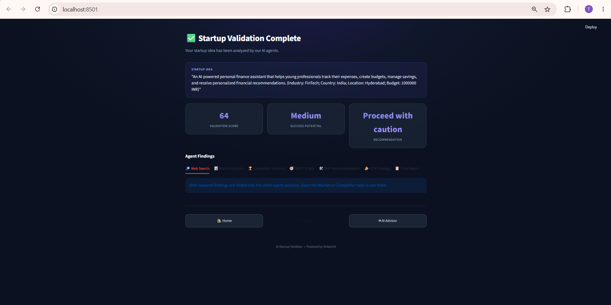
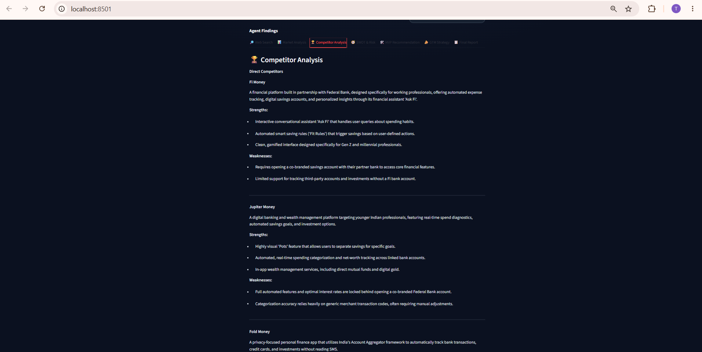
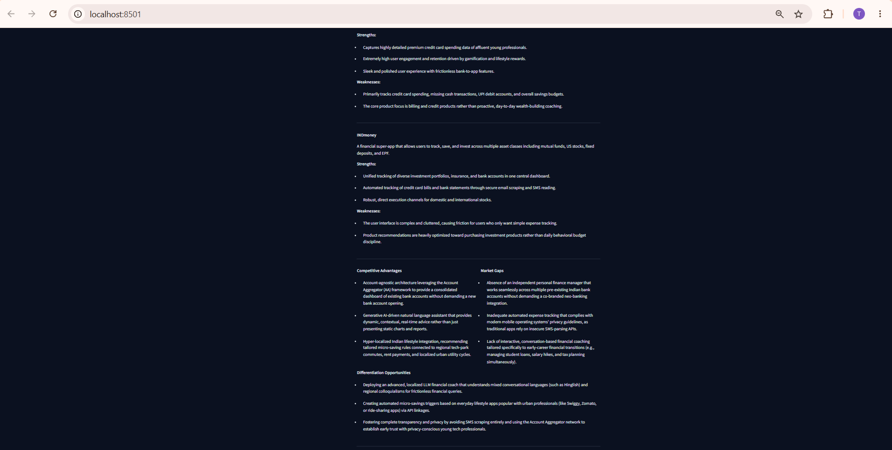
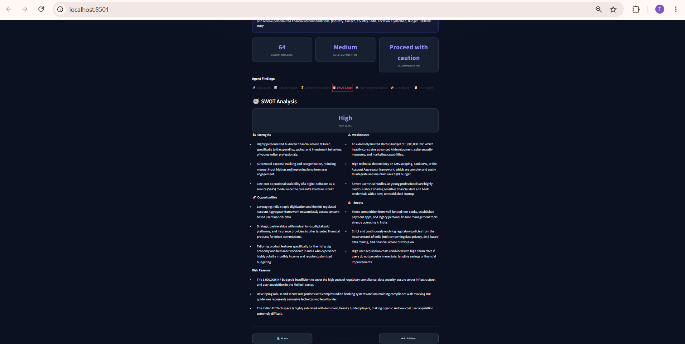
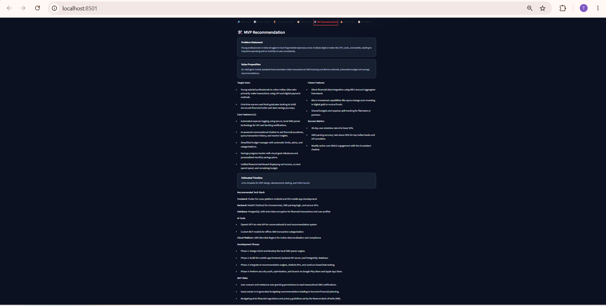
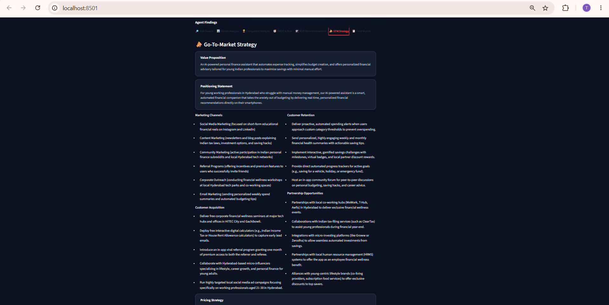
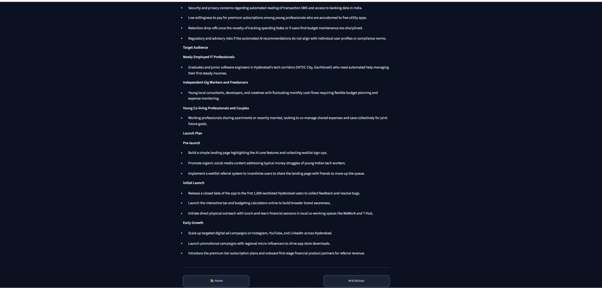
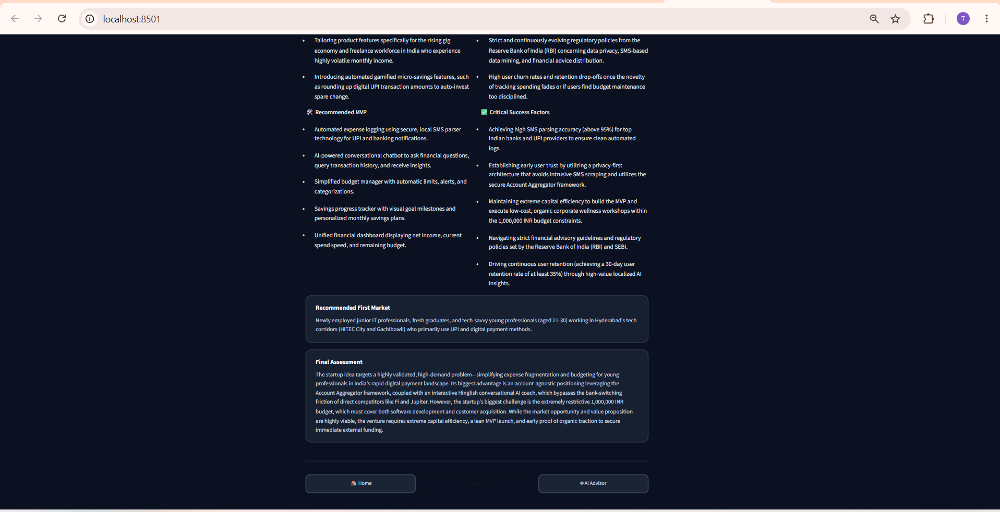
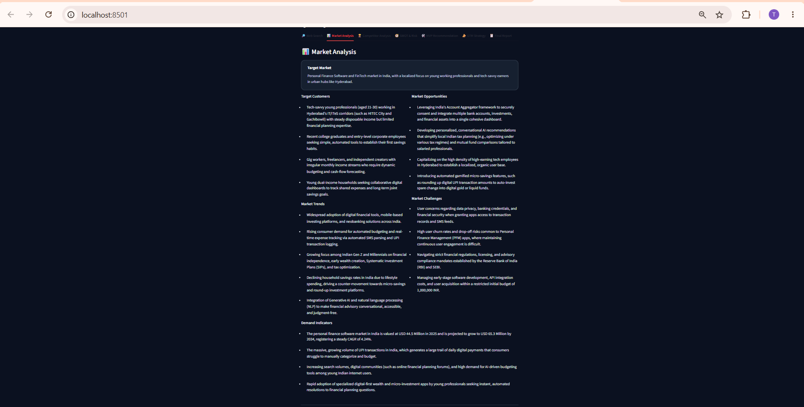

# AI Startup Idea Validator

## Infosys Springboard Virtual Internship Program 7.0

**Batch:** 2  
**Team Members:**  
- Preethi Koppula
- V. Tejaswi Veeravalli
- Akshat Gupta

---

## 1. Project Overview

The **AI Startup Idea Validator** is an AI-powered multi-agent platform designed to help founders evaluate a startup idea before investing significant time and resources in development.

A founder provides a short startup idea together with relevant context such as industry, country, location and budget. The system processes the idea through multiple specialized AI agents. These agents examine different aspects of the opportunity and the results are presented through an interactive Streamlit dashboard.

The platform is intended to support early-stage decision making by bringing market research, competitor analysis, SWOT/risk assessment, MVP planning and go-to-market recommendations into one workflow.

### Core objective

The system aims to answer questions such as:

- Is there a meaningful market opportunity?
- Who are the likely target customers?
- What market trends and demand indicators are relevant?
- Which competitors already address the problem?
- What are the major strengths, weaknesses, opportunities and threats?
- What should the first MVP contain?
- How can the startup approach its first market and acquire customers?
- What overall recommendation should a founder consider?

---

## 2. Problem Statement

Early-stage founders often have to perform market research, competitor research, financial reasoning, risk analysis and product planning separately. This can be time-consuming and may make it difficult to form a consolidated view of the idea.

The project addresses this problem by providing a centralized AI-driven validation workflow in which specialized agents analyze different dimensions of a startup idea and the application presents the resulting insights in a structured report.

---

## 3. Proposed Solution

The proposed solution is a **multi-agent startup validation platform**.

The user submits a startup idea in a few lines and supplies contextual information. An orchestrator coordinates the analysis. Specialized agents generate domain-specific findings, after which an LLM analysis layer synthesizes the available information into actionable recommendations.

The current application interface presents the analysis through sections including:

1. Web Search
2. Market Analysis
3. Competitor Analysis
4. SWOT & Risk
5. MVP Recommendation
6. GTM Strategy
7. Final Report

The result is intended to be easier to interpret than a collection of disconnected research outputs.

---

## 4. Project Workflow

The following workflow represents the high-level processing architecture of the system.



### Workflow explanation

**Step 1 – Startup Idea**

The founder enters the startup concept and supporting details such as industry, target geography and available budget.

**Step 2 – Orchestrator Agent**

The orchestrator coordinates the validation process. It assigns the appropriate analysis tasks and integrates the outputs produced by the agents.

**Step 3 – Specialized Analysis**

The workflow shown in the architecture contains specialized agents for:

- **Market Agent** – examines market size and growth, trends, target audience and demand.
- **Competitor Agent** – identifies competitors and evaluates their strengths, weaknesses, positioning and competitive landscape.
- **Finance Agent** – considers cost estimation, revenue potential, funding requirements and financial feasibility.

**Step 4 – LLM Analysis**

The LLM analysis layer synthesizes the outputs of the agents and turns the collected findings into higher-level analysis and strategic recommendations.

**Step 5 – Final Startup Report**

The system presents a consolidated result containing items such as executive summary, market insights, competitive analysis, financial feasibility, risks/challenges and recommendations.

**Step 6 – Actionable Insights**

The final output is intended to help the founder make a more informed decision about whether and how to proceed with the startup idea.

> **Note:** The workflow diagram is the high-level architecture supplied for the project. The Streamlit dashboard additionally exposes the detailed analysis sections shown in the screenshots below.

---

## 5. Major Functional Modules

### 5.1 Startup Idea Submission

The user provides:

- Startup idea/description
- Industry
- Country
- Location
- Budget

The submitted information becomes the context for the validation pipeline.

### 5.2 Web Search / Data Retrieval

The web-research stage provides external information that can be used by the downstream analysis sections.

The dashboard indicates that web research findings are folded into the Market and Competitor analysis sections.

### 5.3 Market Analysis Agent

The market analysis examines:

- Target market
- Target customers
- Market opportunities
- Market trends
- Market challenges
- Demand indicators

The screenshot from the running application demonstrates the generated market findings.



### 5.4 Competitor Analysis Agent

The competitor analysis identifies relevant existing products/services and compares their strengths and weaknesses.

The dashboard includes a detailed competitor section with examples of direct competitors, their strengths, weaknesses, competitive advantages and market gaps.





### 5.5 SWOT and Risk Analysis

The SWOT module organizes the evaluation into:

- Strengths
- Weaknesses
- Opportunities
- Threats

It also provides a risk level and supporting risk reasons.



### 5.6 MVP Recommendation

The MVP module converts the validation findings into an initial product direction.

It includes:

- Problem statement
- Value proposition
- Target users
- Core features
- Future features
- Success metrics
- Estimated timeline
- Recommended technology stack
- Development phases
- MVP risks



### 5.7 Go-To-Market Strategy

The GTM section describes how the proposed startup could approach its target market.

It includes areas such as:

- Value proposition
- Positioning statement
- Marketing channels
- Customer acquisition
- Customer retention
- Partnership opportunities
- Pricing strategy
- Target audience
- Launch plan
- Recommended MVP
- Critical success factors
- Recommended first market





### 5.8 Final Assessment

The final assessment consolidates the analysis into an overall recommendation.

The demonstrated run produced:

- **Validation Score:** 64
- **Success Potential:** Medium
- **Recommendation:** Proceed with caution

The application also presents a final assessment explaining the opportunity, major constraints, competitive environment and funding/operational considerations.



---

## 6. System Architecture

At a high level, the system can be viewed as the following pipeline:

```text
User / Founder
      |
      v
Startup Idea + Context
      |
      v
Streamlit Application
      |
      v
Orchestrator Agent
      |
      +-------------------+-------------------+
      |                   |                   |
      v                   v                   v
Market Analysis     Competitor Analysis   Finance Analysis
      |                   |                   |
      +-------------------+-------------------+
                          |
                          v
                    LLM Analysis
                          |
                          v
             SWOT / MVP / GTM Synthesis
                          |
                          v
                  Final Assessment
                          |
                          v
             Actionable Startup Insights
```

The architecture is designed around separation of responsibilities: each analysis area can be handled by a specialized agent while the orchestrator and LLM layer provide coordination and synthesis.

---

## 7. Technology Stack

The project is implemented as an AI-powered Python application with an interactive Streamlit interface.

### Frontend / User Interface

- **Streamlit**
- Interactive dashboard
- Tab-based presentation of agent findings
- Dark-themed results interface
- User input and result visualization

### Backend / Application Logic

- **Python**
- Agent orchestration
- Validation pipeline
- Analysis processing
- Report generation
- Application state and supporting utilities

### AI / Agent Layer

- Multi-agent architecture
- Orchestrator agent
- Specialized analysis agents
- LLM-based synthesis
- DeepAgents-based agent workflow in the updated implementation

### Supporting Technologies

- Web/data retrieval tools
- Environment variables for configuration and API credentials
- PDF/report generation support
- Git/GitHub for version control

> Exact model/provider configuration should be kept in the project's environment/configuration files rather than exposing API keys in this document.

---

## 8. Project Structure

The updated project follows a modular structure similar to:

```text
AI-Startup-Idea-Validator-Infosys-Springboard-
│
├── backend/
│   ├── agents/
│   ├── app/
│   │   ├── advisor.py
│   │   ├── agent_factory.py
│   │   ├── api.py
│   │   ├── config.py
│   │   ├── main.py
│   │   ├── orchestrator.py
│   │   └── pdf_generator.py
│   ├── pipeline/
│   ├── state/
│   ├── tests/
│   ├── tools/
│   ├── .gitkeep
│   └── requirements.txt
│
├── docs/
├── frontend/
│   └── streamlit_app.py
│
├── screenshots/
├── ui/
├── venv/
├── venv314/
├── .env
├── .env.example
├── .gitignore
├── LICENSE
├── README.md
├── start.bat
└── start.ps1
```

### Important application files

| File | Purpose |
|---|---|
| `frontend/streamlit_app.py` | Main Streamlit user interface |
| `backend/app/orchestrator.py` | Coordinates the validation workflow |
| `backend/app/agent_factory.py` | Supports creation/configuration of agents |
| `backend/app/advisor.py` | Supports the AI advisor functionality |
| `backend/app/config.py` | Application configuration |
| `backend/app/pdf_generator.py` | Report/PDF generation functionality |
| `backend/app/api.py` | Application API-related logic |
| `backend/app/main.py` | Application/backend entry logic |
| `backend/requirements.txt` | Python dependency specification |
| `start.ps1` | One-click startup script |
| `start.bat` | Windows wrapper for the PowerShell startup script |

---

## 9. Running the Project

### 9.1 Prerequisites

Recommended environment:

- Windows
- Python 3.11 or later for packages that require modern Python versions
- Git
- Project repository
- Required API/configuration values in `.env`

### 9.2 Get the latest project code

From the project root:

```powershell
git pull origin main
```

The active branch for the project is `main`.

### 9.3 Activate the compatible virtual environment

The updated agent stack requires a Python version compatible with `deepagents`. If the older `venv` uses Python 3.10, use the newer environment:

```powershell
deactivate
.\venv314\Scripts\activate
```

Verify:

```powershell
python --version
```

### 9.4 Install dependencies

From the project root:

```powershell
pip install -r backend\requirements.txt
```

If `deepagents` is not already included/installed:

```powershell
pip install deepagents
```

Verify the installation:

```powershell
python -c "import deepagents; print('deepagents installed successfully')"
```

### 9.5 Start the application

The updated project uses **Streamlit as the application entry point**. A separate FastAPI/uvicorn server on port 8000 is not required for the current startup flow.

Run:

```powershell
.\start.ps1
```

Alternatively:

```powershell
start.bat
```

The application starts on:

```text
http://localhost:8501
```

The startup script launches:

```text
frontend/streamlit_app.py
```

on port `8501`.

---

## 10. Input Used in the Demonstrated Run

The screenshots show a sample personal-finance startup idea:

> An AI-powered personal finance assistant that helps young professionals track expenses, create budgets, manage savings, and receive personalized financial recommendations.

The demonstrated context includes:

- **Industry:** FinTech
- **Country:** India
- **Location:** Hyderabad
- **Budget:** 1,000,000 INR

This input was processed successfully by the application and produced the validation result shown in the screenshots.

---

## 11. Demonstrated Results

### 11.1 Overall Validation Result

The completed run displayed:

| Metric | Result |
|---|---|
| Validation Score | **64** |
| Success Potential | **Medium** |
| Recommendation | **Proceed with caution** |

The application confirmed:

> **Startup Validation Complete**

and stated that the startup idea had been analyzed by the AI agents.

### 11.2 Market Analysis Result

The market section generated structured findings around:

- Personal finance software and FinTech
- Young working professionals
- Recent graduates and entry-level employees
- Gig workers and freelancers
- Market trends
- Demand indicators
- Market opportunities
- Market challenges

The analysis also considered localized opportunities for young professionals in Hyderabad.

### 11.3 Competitor Analysis Result

The competitor section identified multiple financial platforms and evaluated their strengths and weaknesses.

The results also highlighted:

- Competitive advantages
- Market gaps
- Differentiation opportunities
- Account Aggregator-related opportunities
- Conversational AI opportunities
- Localized financial experiences

### 11.4 SWOT Result

The SWOT section classified the idea as:

**Risk Level: High**

The analysis discussed:

- Personalized AI-driven financial advice as a strength
- Automated expense tracking
- Low-cost SaaS scalability
- Budget limitations
- Data/security/integration complexity
- Regulatory considerations
- Competition
- Customer acquisition and retention risks

### 11.5 MVP Result

The MVP recommendation included a proposed initial product containing features such as:

- Automated expense logging
- AI-powered conversational assistance
- Simplified budget management
- Savings progress tracking
- Unified financial dashboard

It also provided future features, success metrics, an estimated timeline and implementation considerations.

### 11.6 GTM Result

The GTM analysis covered:

- Social media marketing
- Content marketing
- Community marketing
- Referral programs
- Corporate outreach
- Email marketing
- Customer acquisition
- Customer retention
- Partnerships
- Target audience
- Launch stages
- Critical success factors

### 11.7 Final Assessment

The final assessment concluded that the idea addresses a relevant personal-finance problem but faces significant constraints related to budget, regulatory requirements, security, integrations, competition and customer acquisition.

The result therefore recommends proceeding carefully rather than treating the opportunity as risk-free.

---

## 12. User Interface Screenshots

### 12.1 Workflow Architecture


### 12.2 Validation Completed Dashboard


### 12.3 Market Analysis


### 12.4 Competitor Analysis


### 12.5 SWOT and Risk Analysis


### 12.6 MVP Recommendation


### 12.7 Go-To-Market Strategy


---

## 13. Functional Requirements

### Input Requirements

The application should allow the user to provide:

- Startup idea
- Industry
- Country
- Location
- Budget
- Other context required by the application

### Processing Requirements

The system should:

1. Accept and validate the startup input.
2. Initiate the analysis workflow.
3. Coordinate the specialized agents.
4. Retrieve and process relevant research information.
5. Analyze the market.
6. Analyze competitors.
7. Evaluate SWOT and risk.
8. Recommend MVP features.
9. Generate GTM recommendations.
10. Produce a final assessment.

### Output Requirements

The system should provide:

- Structured agent findings
- Validation score
- Success potential
- Recommendation
- Market insights
- Competitor insights
- SWOT/risk analysis
- MVP recommendations
- GTM strategy
- Final assessment
- Actionable insights

---

## 14. Non-Functional Requirements

### Usability

The dashboard should present complex AI-generated findings in an organized and readable manner.

### Modularity

Different analysis responsibilities are separated into specialized agents/modules.

### Maintainability

The project uses separate application, agent, pipeline, state, tool and frontend directories.

### Extensibility

Additional agents, analysis dimensions and report sections can be added without redesigning the complete user interface.

### Security

API keys and other secrets should be stored in environment configuration and must not be committed to GitHub.

---

## 15. Testing and Validation

The demonstrated application was successfully executed locally using Streamlit.

The screenshots provide evidence that the following sections generated results:

- Validation completion
- Market Analysis
- Competitor Analysis
- SWOT & Risk
- MVP Recommendation
- GTM Strategy
- Final Assessment

The successful run also demonstrates that the agent pipeline can process a startup idea and populate the dashboard with structured results.

### Suggested test cases

| Test Case | Expected Result |
|---|---|
| Valid startup idea | Analysis pipeline starts successfully |
| Empty/invalid required input | Application should request valid input |
| Different industry | Agents should generate industry-specific findings |
| Different location | Market/competitor context should adapt |
| Different budget | Financial/risk recommendations should reflect the supplied context |
| Successful pipeline execution | Results should appear across analysis sections |
| Final report generation | Consolidated assessment should be available |

---

## 16. Advantages

- Reduces the amount of manual early-stage startup research.
- Separates analysis into specialized AI responsibilities.
- Combines multiple business dimensions in one dashboard.
- Provides structured recommendations instead of only raw research.
- Helps founders identify risks before development.
- Supports MVP planning and go-to-market thinking.
- Provides an interactive interface through Streamlit.
- The modular architecture can be extended with additional agents.

---

## 17. Limitations

The output of an AI startup validator should be treated as **decision support**, not as a guarantee of business success.

Potential limitations include:

- AI-generated findings can contain inaccuracies.
- External research data can change over time.
- Competitor information may become outdated.
- Financial projections depend on assumptions and available information.
- Regulatory and financial decisions require appropriate expert validation.
- API availability and model responses can affect results.
- The quality of recommendations depends on the quality of the input and available research.

---

## 18. Future Enhancements

Possible future improvements include:

1. More comprehensive real-time market data integration.
2. More detailed financial forecasting and scenario analysis.
3. Automated source citation for research findings.
4. Historical comparison of multiple startup ideas.
5. User accounts and persistent workspaces.
6. More specialized industry-specific agents.
7. Improved competitor monitoring.
8. More advanced investor-readiness scoring.
9. Automated pitch-deck generation.
10. Continuous monitoring of market and competitor changes.
11. Improved report export and sharing.
12. Stronger evaluation metrics for agent output quality.

---

## 19. Expected Impact

The project aims to make startup validation faster, more structured and more accessible.

Instead of manually researching every business dimension independently, a founder can submit an idea and receive a consolidated analysis covering market opportunity, competition, risk, MVP planning and go-to-market strategy.

This can help founders:

- Identify weak assumptions early.
- Prioritize important product features.
- Understand the competitive landscape.
- Recognize business risks.
- Select an initial target market.
- Make more informed decisions about further validation and development.

---

## 20. Conclusion

The **AI Startup Idea Validator** demonstrates how a multi-agent AI architecture can be applied to early-stage startup evaluation.

The system combines an interactive Streamlit interface with an orchestrated analysis workflow. Specialized analysis stages generate market, competitor, SWOT/risk, MVP and GTM insights, while the LLM analysis layer helps synthesize these findings into a final assessment.

The demonstrated execution successfully produced a validation score, success-potential classification, recommendation and detailed agent findings for a sample FinTech startup idea.

Overall, the project provides a practical foundation for AI-assisted startup research and decision support and can be extended with richer data sources, stronger financial analysis, additional agents and more advanced reporting capabilities.

---

## 21. Team

**Infosys Springboard Virtual Internship Program 7.0 – Batch 2**

| Team Member |
|---|
| Preethi Koppula |
| V. Tejaswi Veeravalli |
| Akshat Gupta |

---

## 22. Repository and Project Management

The project is maintained using Git and GitHub for version control. Team members can synchronize the latest implementation using the `main` branch.

Typical update command:

```powershell
git pull origin main
```

Before pushing changes, generated test artifacts, credentials and unnecessary local files should be kept out of the repository according to `.gitignore`.

---

## 23. Quick Start Summary

For a Windows setup, the current project can be started from the project root with:

```powershell
deactivate
.\venv314\Scripts\activate
python --version
pip install -r backend\requirements.txt
pip install deepagents
python -c "import deepagents; print('deepagents installed successfully')"
.\start.ps1
```

Then open:

```text
http://localhost:8501
```

The current startup script launches the Streamlit application directly; a separate port-8000 backend startup is not required by this updated startup flow.

---

# End of Documentation
